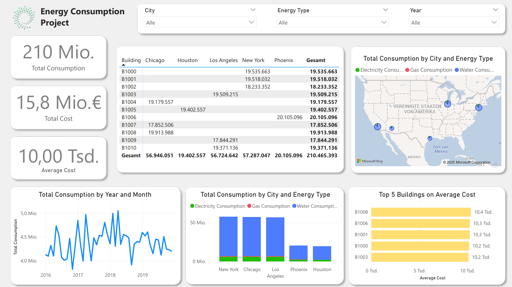

## **1. Project Title**
**Energy Consumption Analysis Dashboard**

## **2. Objective or Problem Statement**
- **Objective:** The goal of this project was to analyze energy consumption across multiple cities and buildings, identify trends, and provide actionable insights for optimizing energy usage and costs.
- **Problem Statement:** Organizations often struggle to monitor energy consumption efficiently across different locations. This dashboard was designed to centralize data and provide a clear overview of consumption patterns by city, building, and energy type.

## **3. Data Source**
- **Description:** The dataset included detailed information on energy consumption (electricity, gas, water) for buildings in five major U.S. cities (Chicago, Houston, Los Angeles, New York, Phoenix) from 2016 to 2019.
- **Key Variables:** 
  - City
  - Building ID
  - Energy Type (Electricity, Gas, Water)
  - Year/Month
  - Total Consumption
  - Total Cost

## **4. Tools and Techniques**
- **Tools Used:**  
  - Power BI: For creating the interactive dashboard and visualizations.  
  - Excel: For initial data cleaning and preparation.
- **Techniques:**  
  - Data aggregation by city, building, and energy type.  
  - Trend analysis (monthly and yearly).  
  - Cost analysis to identify high-cost buildings.

## **5. Approach**
### Step-by-Step Workflow:
1. **Data Cleaning:** Removed duplicates, handled missing values, and standardized formats for energy types.
2. **Data Aggregation:** Summarized consumption and costs by city, building, and energy type.
3. **Visualization Design:** Created charts (line graphs, bar charts, pie charts) to highlight trends.
4. **Interactivity:** Added slicers for filtering by city, year, and energy type to make the dashboard dynamic.

## **6. Key Insights**
### From the Dashboard:
1. **Total Consumption Trends:**
   - Energy consumption peaked in mid-2018 across all cities.
   - Seasonal fluctuations were evident in monthly consumption patterns.
2. **City-Level Insights:**
   - New York had the highest total energy consumption across all types.
   - Houston had the lowest overall consumption but higher costs per unit of energy.
3. **Building-Level Insights:**
   - Building B1008 incurred the highest average cost per unit of energy.
   - Top 5 buildings by average cost were identified for targeted optimization efforts.
4. **Energy Type Analysis:**
   - Electricity accounted for the largest share of total consumption in all cities.

## **7. Impact**

  - Monitor energy usage trends dynamically across multiple dimensions (city, building, year).
  - Identify high-cost buildings for targeted interventions to reduce expenses.
  - Optimize resource allocation based on historical consumption patterns.

## **8. Challenges Faced**
- Managing large datasets with inconsistent formats required advanced cleaning techniques in Excel before importing into Power BI.
- Designing an intuitive dashboard layout that balances complexity with usability for non-technical users.

## **9. Reflection**
- This project enhanced my skills in creating interactive dashboards using Power BI and analyzing multi-dimensional datasets effectively.
- It demonstrated my ability to transform raw data into actionable insights that drive decision-making.

## **10. Link or Access**

